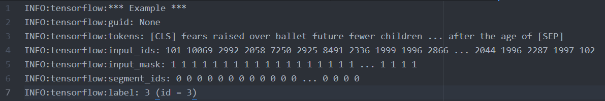

# NLP Tasks
以下為一些NLP的進階應用範例。
### 01 BERT_multiclass_TF_hub.ipynb
此範例說明如何使用TensorFlow Hub的BERT model來做multi-class的文章分類。[1]  
訓練資料需要轉換成BERT可以接收的format，包含：  
- Tokenize文章中所有的單字以及標點符號。  
- 加上 [CLS] 和 [SEP] tokens 來標註文章的開始和結束。  
- 進一步將一些字分成 WordPieces (例： "calling" -> ["call", "##ing"])  
- 根據BERT的字典，將字mapping到字的index。  
- input_masks幫助區分tokens和padding elements，0代表padding elements。  
- segment_ids幫助區分不同的句子。因為在分類問題只有一個句子，所以所有的segment id都是一樣的。若有兩個句子時，第一個句子的所有字都會是0，第二個句子的所有字都會是1。  

以下為將一篇文章轉成BERT格式的範例：  
  
雖然此範例為英文文章分類，若要做中文分類，只要下載中文的model即可。[2][3]  

## References
[1] https://analyticsindiamag.com/step-by-step-guide-to-implement-multi-class-classification-with-bert-tensorflow/  
[2] https://tfhub.dev/s?network-architecture=transformer&publisher=google  
[3] https://tfhub.dev/google/bert_chinese_L-12_H-768_A-12/1  
